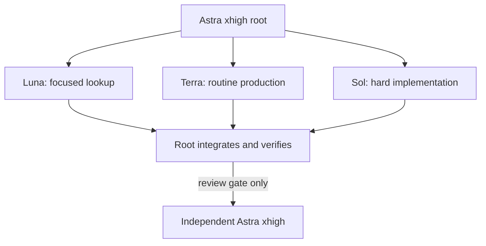

# Model routing

Check which models and effort levels the current harness exposes. Preserve the roles below when an exact model is unavailable.

| Work | Preferred route | Use when | Avoid when |
|---|---|---|---|
| Scope, decompose, arbitrate, integrate | Astra `xhigh` | Decisions affect the whole run | The task is routine and already well specified |
| Search, inventory, extract, classify, locate symbols, focused documentation lookup | Luna `max` | Output is bounded and evidence-based | Architectural synthesis or ambiguous product judgment is required |
| Routine code, documents, transformations, targeted tests | Terra `high` | Requirements and touched surface are clear | The subtask is unusually complex or high stakes |
| Difficult implementation, debugging, migrations, complex tests | Sol `high` | A bounded task still needs strong coding or reasoning | Luna or Terra can meet the same acceptance criteria |
| Independent consequential review | Astra `xhigh` | The SKILL.md review gate opens | The change is low risk, local, and covered by tests |

## Fallback order

- If Luna is unavailable, use Terra at the lowest sufficient effort.
- If Terra is unavailable, use Sol for production work and tighten the task packet.
- If Sol is unavailable, use Astra for the hard worker task but reduce worker count and prevent duplicated context.
- If effort cannot be selected, keep the model role and control cost through scope, context, and agent count.

## Routing principle

Choose for one-pass success, not the lowest per-token rate. A worker that predictably fails and triggers a second full-context attempt is often the expensive route.
